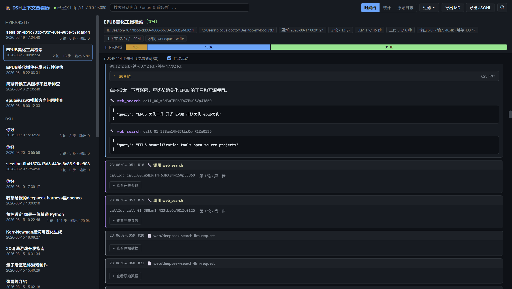

# 🕵️ DSH Context Viewer

> **[中文版 README](README.md)**

[](https://github.com/shiningsprk-arch/dsh-context-viewer/releases/latest)


A desktop context viewer for **DeepSeek Harness** (Electron + React). Browse the **complete
information** of historical and live sessions: chain-of-thought (reasoning), shell commands
(pwsh/bash), tool call arguments & results, errors, token statistics, and the raw event log.



## Download

1. Get `dsh-context-viewer-win32-x64.zip` from [**Releases**](https://github.com/shiningsprk-arch/dsh-context-viewer/releases/latest)
2. Unzip and run `DSHContextViewer.exe` (Windows x64 portable, no installation)

> Prerequisite: a running DSH host (Web UI defaults to `http://127.0.0.1:3080`).
> The viewer **reads the launch token from the DSH log automatically** — no manual setup.

## Features

- **Session list**: grouped by workspace, with title / time / turns / steps / token stats and live running status
- **Event timeline**: user messages, assistant messages / attempts (V3, with collapsible chain-of-thought),
  tool call cards (shell commands highlighted), tool results (including errors),
  turn/step boundaries, streaming deltas (collapsed by default)
- **Filtering**: filter events by category (user / assistant / thinking / calls / results / boundaries / streaming / other)
- **Live view**: connects to a running DSH over WebSocket (`/api/remote.mux` → `session/follow`), new events
  are appended in real time; in-progress output shows as a "live" card
- **Stats panel**: token usage, context pressure, tool call distribution, event type distribution
- **Raw log**: per-event raw JSON (searchable, expand-all)
- **Export**: Markdown / JSONL / JSON
- **Global search**: uses DSH's `session/search` service to search across all sessions
- **Chinese UI**, dark theme

## Compatibility

| DSH version | Viewer version |
| --- | --- |
| **0.1.5+** (Typert protocol + browser auth) | **v0.2.0+** (current) |
| 0.1.0 – 0.1.2 (legacy protocol) | v0.1.0 |

## Prerequisites

- A running DSH host, version ≥ 0.1.5
- Windows x64 for the portable build; Node.js ≥ 22 for source builds
- The viewer reads the address and token from the most recent launch log line:
  - `%LOCALAPPDATA%\dsh\dsh-web.out.log` (default)
  - `%USERPROFILE%\Desktop\dsh\dsh-service.out.log` (legacy launcher location)
  - the port printed in the log is picked up automatically
- Global search requires the server session index: `session-query-sqlite.openAt` must not be
  `never` (use `first-search`, see FAQ below)

## FAQ

**"Not connected to DSH" / auth failure?**
The viewer reads the launch token from the last line of `%LOCALAPPDATA%\dsh\dsh-web.out.log`.
If your DSH is started differently and the log lives elsewhere, please open an issue; you can
also override the server address with the `DSH_CV_BASE_URL` environment variable
(default `http://127.0.0.1:3080`).

**Global search says "session search is disabled"?**
The server disables the session index by default. Add this to the profile's `cordis.patch.yml`
(note: a patch **replaces** the plugin config, so `path` must be included):

```yaml
- id: session-query-sqlite
  config:
    path: ':memory:'
    openAt: first-search
```

**After a DSH restart `127.0.0.1` asks for authentication?**
That is DSH Web's own browser-auth mechanism (the token changes on every launch) and is
unrelated to this viewer. Open the newest `?token=` URL from the log once in your browser to
re-establish trust.

## Development

```bash
# Install dependencies (Electron is downloaded on first install;
# in mainland China you can use the npmmirror mirror:
#   $env:ELECTRON_MIRROR='https://npmmirror.com/mirrors/electron/'
#   npm install --registry=https://registry.npmmirror.com)
npm install

# Dev mode (Vite HMR + Electron)
npm run dev

# Build and start
npm start

# Package a Windows portable build (outputs to release/)
npm run pack
```

> If `electron-packager` fails due to network issues, you can assemble the portable
> build with the local script:
> ```powershell
> powershell -ExecutionPolicy Bypass -File pack-manual.ps1
> ```
> (Copies the Electron runtime + dist output + the ws dependency into
> `release/DSHContextViewer-win32-x64/`.)

## Automated verification

Set `DSH_CV_SHOT=<png path>` when starting the app and the main process will inspect the
DOM, select a session, walk through the main views, take a screenshot, and quit
(verification hook; not triggered in normal use). Use `DSH_CV_SESSION=<session id>` to
open a specific session.

```powershell
$env:DSH_CV_SHOT='C:\shot.png'
$env:DSH_CV_SESSION='session-xxxxxxxx-...'
& '.\release\DSHContextViewer-win32-x64\DSHContextViewer.exe'
```

## Data sources

- Auth: GET `/?token=<launch token>` to mint a `dsh-auth-*` cookie, sent on HTTP and WebSocket
- HTTP unary: `POST /api/<endpoint>` (`session/list` / `session/page` / `session/search`), payload `{ args }`
- Live streams: WebSocket `/api/remote.mux`
  - `workspace/follow`: workspace baseline + increments (upsert/remove/order/archived)
  - `session/follow`: session snapshot (records + projections) + live events + `assistant-stream` frames
- History pagination: `session/page` (`address` + `throughSeq` from the snapshot cursor + `beforeSeq`)

## Project layout

```
electron/         Main process (window, DSH API client, IPC, live push)
shared/           Shared types & labels (main/renderer)
src/              React renderer
  components/     Components (timeline, cards, stats, raw log, sidebar …)
  store.tsx       Global state (sessions/events/filter/push merging)
docs/             Screenshots and documentation assets
```

## CI / Releases

Pushing to `main` builds artifacts; pushing a `v*` tag builds and publishes a GitHub
**Release** with the portable zip:

```powershell
git tag v0.2.0
git push origin v0.2.0
```

Download the latest release: <https://github.com/shiningsprk-arch/dsh-context-viewer/releases>
